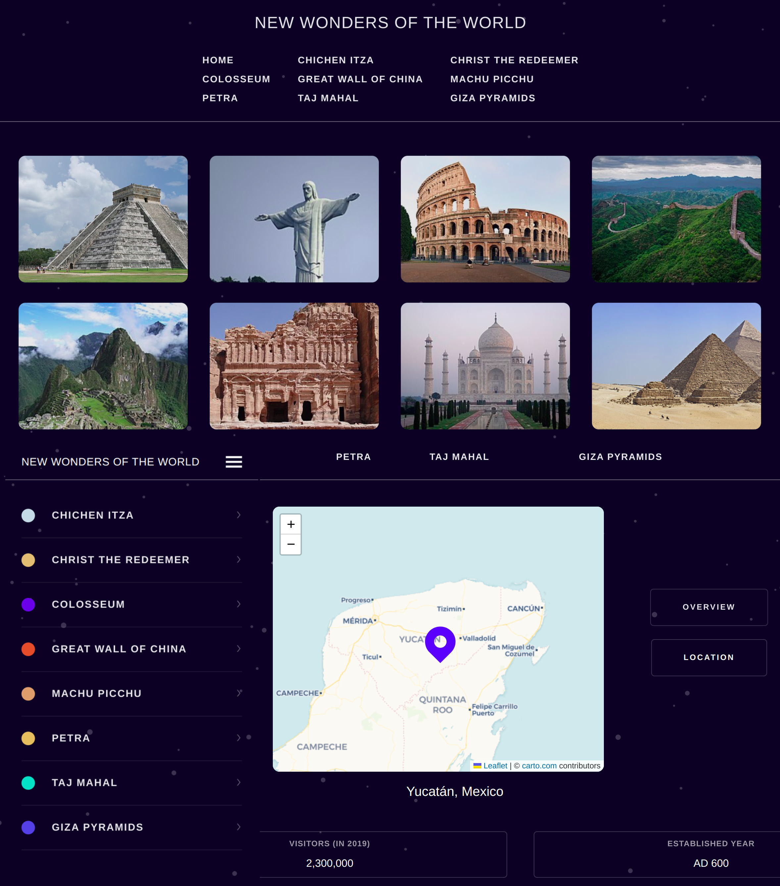

# New Wonders of the World - React + TypeScript

## Table of contents

- [Overview](#overview)
  - [Screenshot](#screenshot)
  - [Links](#links)
- [My process](#my-process)
  - [Built with](#built-with)
- [Author](#author)

## Overview

### Screenshot

- Device 375px/650px/1200px

### Links

- Solution URL: [GitHub](https://github.com/Giorgi-Jalali/new-wonders-of-the-world)
- Live Site URL: [GitHub Pages](https://new-wonders-of-the-world.vercel.app/)

## My process

### Built with

- Flexbox
- CSS Grid
- Mobile-first workflow
- [React](https://reactjs.org/) - JS library
- [React Router] (https://reactrouter.com/en/main) - for pages
- [TypeScript](https://www.typescriptlang.org/) - for types
- [Styled Components](https://styled-components.com/) - for styles
- [LeafletJS](https://leafletjs.com/) - for Map
- [React Leaflet](https://react-leaflet.js.org/) - for Map in React

## Author

- LinkedIn - [Giorgi Jalali](https://www.linkedin.com/in/giorgi-jalali-0336b8225/)
